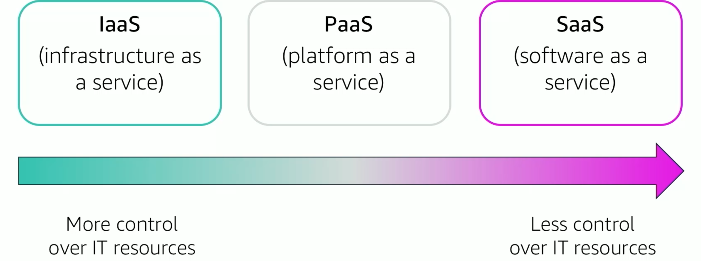

# 1. Introduction to Cloud Computing
**Cloud computing** is the **on-demand** delivery of compute power, database, storage, applications, and other IT resources **via the internet** with **pay-as-you-go** pricing. It is stored in data centers.

- Flexible
- More cost-effective than hardware
- Can change more quickly and easily
- Eliminated undiferentiated heavy-lifting tasks

**Cloud Service models**

**Deployment models**

**Comparison between traditional and AWS cloud**

# 2. Advantages
- Capital expense vs variable expense: pay only for what you consume
- Lower pas-as-you-go prices due to its high scalability
- Scaling on demand
- Increase speed and agility: new resources might need to be approved, but cloud is "infinite" and extermely scalable within minutes
- Don't need to run and maintain data centers

# 3. Introduction to AWS
A **web service** is any piece of software that makes itself available over the internet and uses a standardized format such as XML or JSON for the request and the response of an application programming interface (API) interaction.

* Secure cloud platform that offers a **broad set of global cloud-based products**.
* **On-demand access** to compute, storage, network, database, and other IT resources and management tools.
* **Flexibility**.
* You pay only for the individual services you need, for **as long as you use them**.
* AWS services work **together** like building blocks.

There are 3 ways to access AWS:
- AWS Management Console
- Command Line Interface (AWS CLI)
- Software Development Kits (SDKs)

# 4. Moving to AWS Cloud
* AWS CAF provides **guidance and best practices** to help organizations build a comprehensive approach to cloud computing across the organization and throughout the IT lifecycle to **accelerate successful cloud adoption**.
* AWS CAF is organized into six **perspectives**.
* Perspectives consist of sets of **capabilities**.

## 4.2 Perspectives
- **Business**: we must ensure that IT **is aligned with business needs**, and that IT investments can be traced to demonstrable business results.

- **People**: we must prioritize **training, staffing, and organizational changes** to build an agile organization.

- **Governance**: we must ensure that **skills and processes align IT strategy and goals with business strategy and goals** so the organization can maximize the business value of its IT investment and minimize business risks.

- **Platform**: we must **understand and communicate the nature of IT systems and their relationships.** We must be able to **describe the architecture of the target state environment in detail.**

- **Security**: we must ensure that the organization **meets its security objectives.**

- **Operations**: we align with and support the operations of the business, and **define how day-to-day, quarter-to-quarter, and year-to-year business will be conducted.**