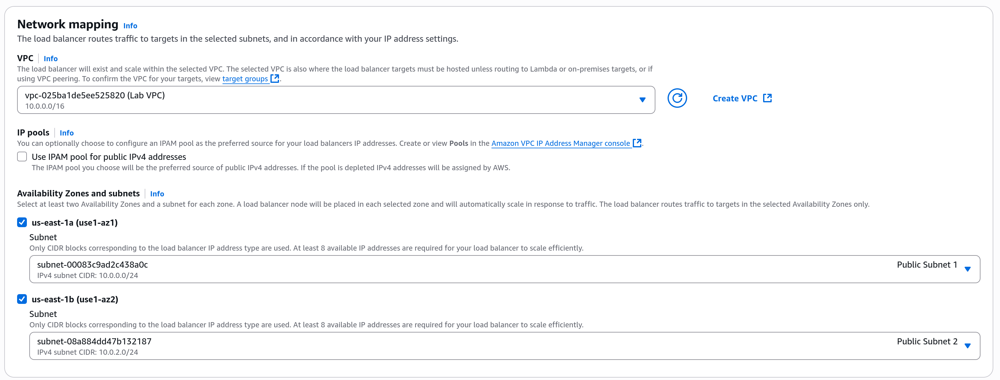
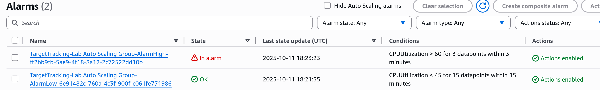

# Important Steps
- In this lab we start with a very very similar infrastructure from lab 5. This time, we are using a load balancer to distribute the load into different AZ.

- We create the image so that it is scaled automatically:

- Now we create a load balancer, the main part of this lab. This load balancer will distribute the load between multiple EC2 instances. To do this, first we create the target groups that the load balancer will route packets to:

- Now we create an application load balancer that operates at request level (layer 7)

- We create an EC2 instance template. When it needs to scale up and needs more instances, these instances will look like this template:

- The load balacner is configured correctly:

- The number of instances used will go from 2 to 6 depending on the load received. We can see there are 2 more instances now because the minimum set was 2:

- Now we need to check it is working correctly. First we see the load balancer is chill because the CPU usage is low:

- Then the CPU usage goes to 100% and it needs to rescale. Now we can see the alarms have been triggered and that there are more than 2 instances now:

