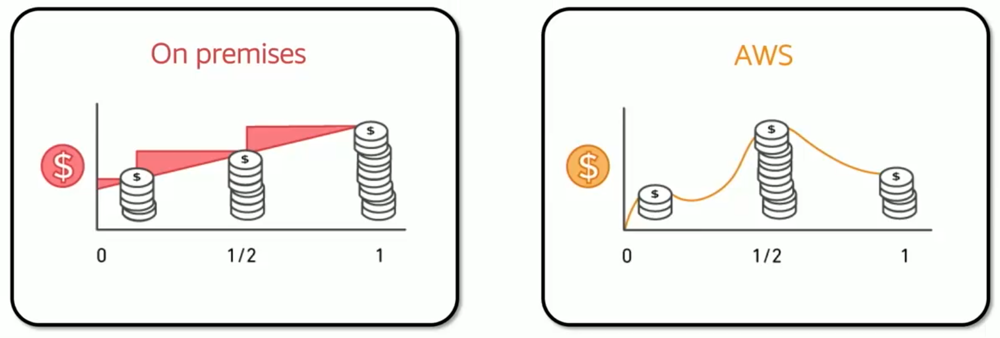
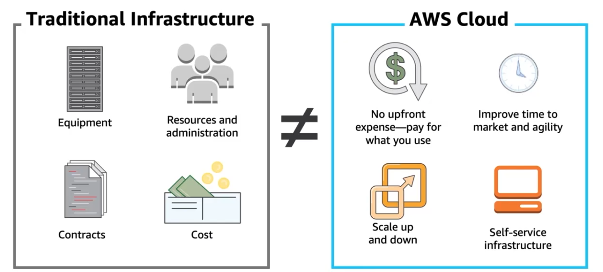
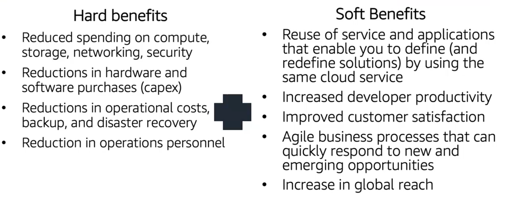
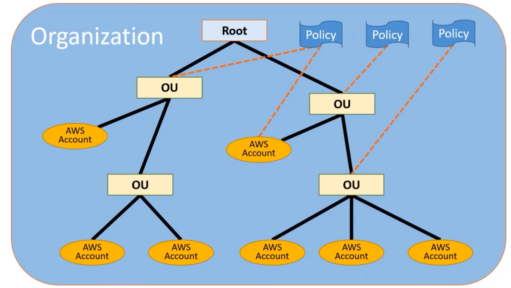
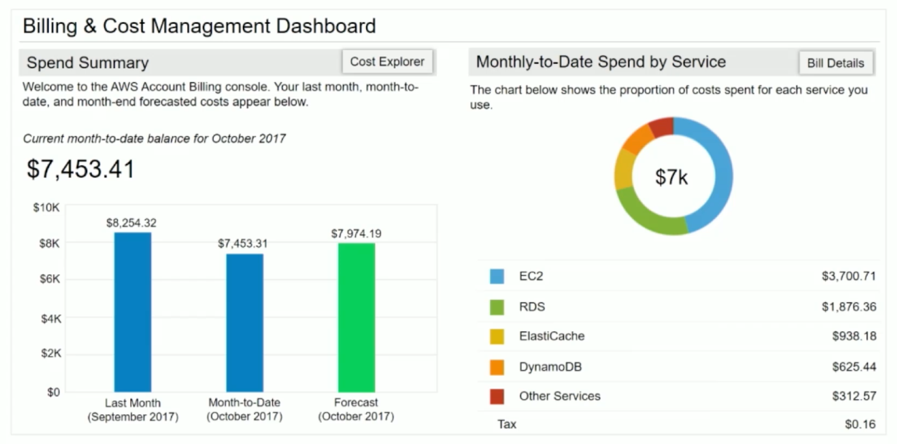
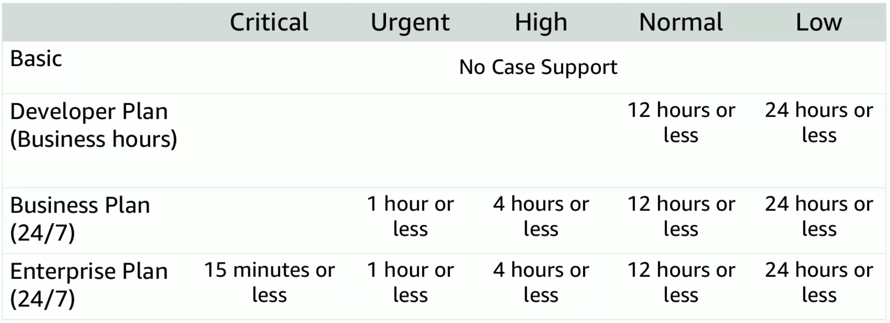

# 1. AWS Pricing Model
## 1.1 Fundamental drivers of cost
<table>
<tr>
    <td class="top-align"><strong>Compute</strong></td>
    <td>
    <ul>
        <li>Charged hour/second</li>
        <li>Varies by instance type</li>
    </ul>
    </td>
</tr>
<tr>
    <td class="top-align"><strong>Storage</strong></td>
    <td>
    <ul>
        <li>Charged typically per GB</li>
    </ul>
    </td>
</tr>
<tr>
    <td class="top-align"><strong>Data transfer</strong></td>
    <td>
    <ul>
        <li>Outbound is aggregated and charged</li>
        <li>Inbound has no charge (with some exceptions)</li>
        <li>Charged typically per GB</li>
    </ul>
    </td>
</tr>
</table>

- Pay for what you use

- Pay less by using more: the more you use the less you pay per GB
- Pay less when you reserve
- Pay less when you use more and as AWS grows
- Custom pricing is available
- AWS free tier lasts for 1 year

## 1.2 Total Cost of Ownership (TCO)
Financial estimate to help identify direct and indirect costs of a system.

## 1.3 AWS Pricing Calculator
* Estimate monthly costs
* Identify opportunities to reduce monthly costs
* Model your solutions before building them
* Explore price points and calculations behind your estimate
* Find the available instance types and contract terms that meet your needs
* Name your estimate and create and name **groups** of services

 ## 1.4 Estimate
 - First 12 months total: sum of all the resources you are using for your groups. Sum of the other 2.
- Total upfront: estimate you need to pay upfront as you set up your AWS stack.
- Total monthly: monthly estimate while you run your AWS stack.

# 2. AWS Organizations
Allows you to consolidate multiple AWS accounts into an organiational tree with each branch representing a department or team.

- **Organizational Unit (OU)**
- Policy-based account management
- Group based account management
- Application prorgamming interfaces (APIs) to automate account management
- Consolidated billing

To access it you can use the conventional ways and one additional one: HTTPS query application programming interfaces (API).

# 3. Billing Tools
- **Billing dashboard**

- AWS Budgets
- AWS Cost and Usage Report: detailed from last 2 months
- AWS Cost Explorer: overview from last year

# 4. Technical Support Models
<table>
<tr>
    <td class="top-align"><strong>Account assistance</strong></td>
    <td>
    <ul>
        <li>Provide quick and efficient analysis.</li>
        <li>Non-technical billing.</li>
    </ul>
    </td>
</tr>
<tr>
    <td class="top-align"><strong>AWS Trusted Advisor</strong></td>
    <td>
    <ul>
        <li>Automated service that acts like a customized cloud expert.</li>
        <li>Looks for opportunities to reduce monthly expenditures and increase productivity.</li>
    </ul>
    </td>
</tr>
<tr>
    <td class="top-align"><strong>Technical Account Manager (TAMs)</strong></td>
    <td>
    <ul>
        <li>Provide guidance, architectural review, and ongoing communication.</li>
        <li>Only available through the Enterprise Support plan.</li>
    </ul>
    </td>
</tr>
</table>

**Support plans**
<table>
<tr>
    <td class="top-align"><strong>Basic Support</strong></td>
    <td>Resource Center access, Service Health Dashboard, product FAQs, discussion forums, and support for health checks</td>
</tr>
<tr>
    <td class="top-align"><strong>Developer Support</strong></td>
    <td>Support for early development on AWS</td>
</tr>
<tr>
    <td class="top-align"><strong>Business Support</strong></td>
    <td>Customers that run production workloads</td>
</tr>
<tr>
    <td class="top-align"><strong>Enterprise Support</strong></td>
    <td>Customers that run business and mission-critical workloads</td>
</tr>
</table>

