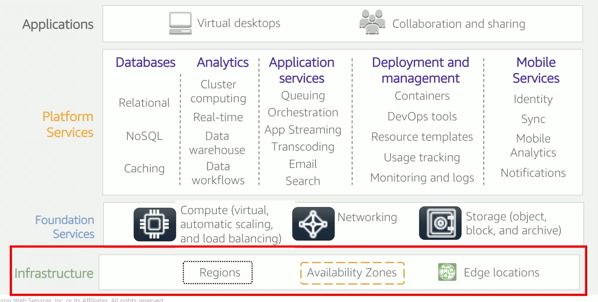
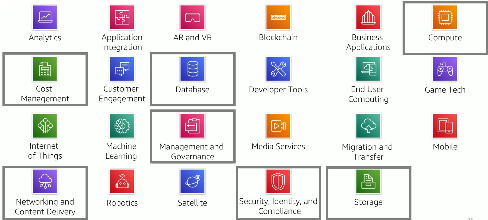

# 1. Global Infrastructure
## 1.1 Components
<table>
<tr>
    <td class="top-align"><strong>AWS Region</strong></td>
    <td>
    <ul>
        <li>Geographical area (take into account data legal requirements)</li>
        <li>With 2 or more <strong>Availability Zones (AZ)</strong></li>
        <li>Isolated from one another</li>
        <li>Data replication across regions is controlled by the customer</li>
        <li>Communication between regions uses AWS backbone network infrastructure</li>
        <li>Not all services are available in all regions</li>
        <li>Costs vary on region</li>
    </ul>
    </td>
</tr>
<tr>
    <td class="top-align"><strong>Availability Zone (AZ)</strong></td>
    <td>
    <ul>
        <li>Fully isolated partition of the AWS infrastructure</li>
        <li>Smallest granular level of specification that a customer can make</li>
        <li>One or more data centers</li>
        <li>Fault isolation</li>
        <li>Interconnected by high-bandwidth private network</li>
        <li>Normally it is recommended to replicate data and resources across AZs</li>
    </ul>
    </td>
</tr>
<tr>
    <td class="top-align"><strong>Data Centers</strong></td>
    <td>
    <ul>
        <li>Where data is stored and processed</li>
        <li>If all your data is in one data center and there is a failure, you will have 0 availability</li>
        <li>Locations are not disclosed and access to them is restricted</li>
    </ul>
    </td>
</tr>
<tr>
    <td class="top-align"><strong>ODMs</strong></td>
    <td>
    <ul>
        <li>Design and manufacture products based on specifications from a second company</li>
    </ul>
    </td>
</tr>
<tr>
    <td class="top-align"><strong>Points of Presence (PoP)</strong></td>
    <td>
    <ul>
        <li>187 locations</li>
        <li>Regional edge caches used for content with infrequent access</li>
        <li>Used with Amazon CloudFront</li>
        <li>Regional and Edge locations</li>
    </ul>
    </td>
</tr>
</table>

## 1.2 Features
- Elasticity and scalability
- Fault-tolerance
- High availability

# 2. AWS Services

## 2.1 Storage
* Amazon Simple Storage Service (Amazon S3)
* Amazon Elastic Block Store (Amazon EBS)
* Amazon Elastic File System (Amazon EFS)
* Amazon Simple Storage Service Glacier

## 2.2 Compute
* Amazon EC2
* Amazon EC2 Auto Scaling
* Amazon Elastic Container Service (Amazon ECS)
* Amazon EC2 Container Registry
* AWS Elastic Beanstalk
* AWS Lambda
* Amazon Elastic Kubernetes Service (Amazon EKS)
* AWS Fargate

## 2.3 Database
* Amazon Relational Database Service
* Amazon Aurora
* Amazon Redshift
* Amazon DynamoDB

## 2.4 Networking and content delivery (CDN)
* Amazon VPC
* Elastic Load Balancing
* Amazon CloudFront (CDN)
* AWS Transit Gateway
* Amazon Route 53
* AWS Direct Connect
* AWS VPN

## 2.5 Security, Identity and Compliance
* AWS Identity and Access Management (IAM)
* AWS Organizations
* Amazon Cognito
* AWS Artifact
* AWS Key Management Service
* AWS Shield

## 2.6 Cost Management
* AWS Cost and Usage Report
* AWS Budgets
* AWS Cost Explorer

## 2.7 Management and Governance
* AWS Management Console
* AWS Config
* Amazon CloudWatch
* AWS Auto Scaling
* AWS Command Line Interface
* AWS Trusted Advisor
* AWS Well-Architected Tool
* AWS CloudTrail

