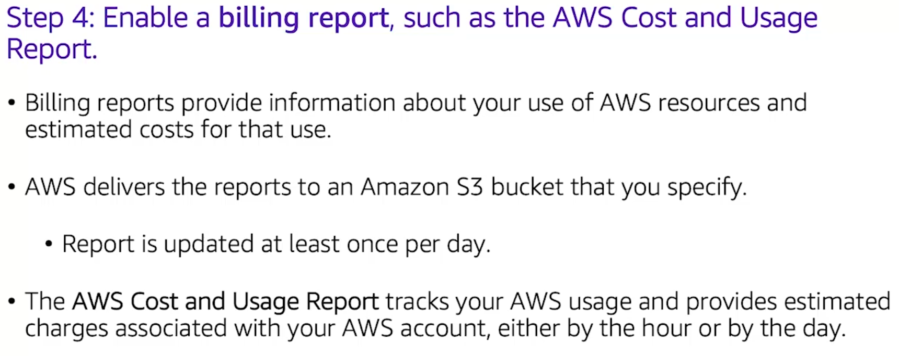

# 1. AWS Shared Responsibility Model
## 1.1 Characteristics

| Customer Responsibilities | AWS Responsibilities |
| :--- | :--- |
| **Amazon Elastic Compute Cloud (Amazon EC2) instance operating system**   • Including patching, maintenance | **Physical security of data centers**   • Controlled, need-based access |
| **Applications**   • Passwords, role-based access, etc. | **Hardware and software infrastructure**   • Storage decommissioning, host operating system (OS) access logging, and auditing |
| **Security group configuration** | **Network infrastructure**   • Intrusion detection |
| **OS or host-based firewalls**   • Including intrusion detection or prevention systems | **Virtualization infrastructure**   • Instance isolation |
| **Network configurations** | |
| **Account management**   • Login and permission settings for each user | |

## 1.2 IaaS vs. PaaS vs. SaaS

| Feature / Criteria | **Infrastructure as a Service (IaaS)** 🏢 | **Platform as a Service (PaaS)** 🛠️ | **Software as a Service (SaaS)** 💻 |
| :--- | :--- | :--- | :--- |
| **Basic Definition** | Provides virtualized computing resources (servers, storage, networking) over the internet. It's the fundamental building block for cloud IT. | Provides a ready-made environment to develop, test, deliver, and manage software applications, abstracting away the underlying infrastructure. | Provides ready-to-use software applications accessed over the internet, typically on a subscription basis. |
| **Analogy** | **Renting Land:** You get the land and utility hookups, but you are responsible for building the house, furnishing it, and maintaining it. | **Renting a Workshop:** You get the building, tools, and power, allowing you to focus on creating your product without worrying about the workshop itself. | **Renting a House:** The house is fully built, furnished, and maintained. You just move in and use it. |
| **What You Manage** | • Applications   • Data   • Runtime   • Middleware   • **Operating System** | • Applications   • Data | You simply use the software and manage your account/data within it. You don't manage any of the underlying technology stack. |
| **What AWS Manages** | • Virtualization   • Servers   • Storage   • Networking | • Runtime   • Middleware   • **Operating System**   • Virtualization   • Servers   • Storage   • Networking | • **Everything:** Applications, Data, Runtime, Middleware, OS, Virtualization, Servers, Storage, and Networking. |
| **Flexibility & Control** | **Highest level of flexibility** and granular control over hardware and operating systems. | **Medium flexibility.** You control the application and data, but the platform (OS, runtime) is managed for you, which speeds up development. | **Lowest flexibility.** You use the software as-is, with options limited to the configurations offered by the provider. |
| **Common Use Cases** | Migrating on-premises workloads, hosting traditional applications, disaster recovery, and situations requiring full control over the environment. | Rapidly developing and deploying web and mobile applications, data analytics, and situations where developer productivity is key. | End-user applications like email, collaboration tools (CRM, ERP), file storage, and business productivity software. |
| **AWS Examples** | • **Amazon EC2** (Virtual Servers)   • **Amazon EBS** (Block Storage)   • **Amazon VPC** (Virtual Network) | • **AWS Elastic Beanstalk** (App Deployment)   • **Amazon RDS** (Managed Databases)   • **AWS Lambda** (Serverless Compute) | • **AWS Trusted Advisor** (Optimization)   • **AWS Shield** (DDoS Protection)   • **Amazon Chime** (Communications) |
| **General Examples** | DigitalOcean, Google Compute Engine, Microsoft Azure Virtual Machines. | Heroku, Google App Engine, Salesforce Platform. | Microsoft 365, Google Workspace, Dropbox, Salesforce. |

# 2. IAM
## 2.1 Components
**Identity and Access management** is a tool that centrally manages access to launching, configuring, managing and terminating resources in your AWS account. It is a free of charge feature.
   

## 2.2 Authentication

<table>
  <thead>
    <tr>
      <th>Access Type</th>
      <th>Authentication Method</th>
      <th>Tools/Access Provided</th>
    </tr>
  </thead>
  <tbody>
    <tr>
      <td class="top-align"><strong>Programmatic Access</strong></td>
      <td>
        <ul>
          <li>Access key ID</li>
          <li>Secret access key</li>
        </ul>
      </td>
      <td>
        <ul>
          <li>AWS CLI</li>
          <li>AWS Tools and SDKs</li>
        </ul>
      </td>
    </tr>
    <tr>
      <td class="top-align"><strong>AWS Management Console Access</strong></td>
      <td>
        <ul>
          <li>12-digit Account ID or alias</li>
          <li>IAM user name</li>
          <li>IAM password</li>
          <li>Multi-factor authentication (MFA) prompts for an authentication code if enabled.</li>
        </ul>
      </td>
      <td>AWS Management Console</td>
    </tr>
  </tbody>
</table>

## 2.2 Authorization
- Assign permissions by creating an IAM policy.
- Permissions determine which resources and operations are allowed:
- All permissions are implicitly denied by default.
- If something is explicitly denied, it is never allowed.
- The scope of IAM service configurations is global. Settings apply across all AWS Regions.

Best practice: Follow the principle of **least privilege**.

<table>
  <thead>
    <tr>
      <th>Type</th>
      <th>Characteristics</th>
    </tr>
  </thead>
  <tbody>
    <tr>
      <td class="top-align"><b>IAM Group</b></td>
      <td>
        <ul>
          <li>A collection of IAM users.</li>
          <li>Used to grant the same permissions to multiple users by attaching IAM policies.</li>
          <li>A user can belong to multiple groups.</li>
          <li>There is no default group.</li>
          <li>Groups cannot be nested.</li>
        </ul>
      </td>
    </tr>
    <tr>
      <td class="top-align"><b>IAM Policy</b></td>
      <td>
        <ul>
          <li>A document that defines permissions for fine-grained access control.</li>
          <li>Two main types: identity-based and resource-based.</li>
          <li><b>Identity-based policies</b> attach to an IAM entity (user, group, or role) and specify allowed/denied actions.</li>
           <li><b>Resource-based policies</b> attach directly to a resource (like an S3 bucket).</li>
          <li>A single policy can be attached to multiple entities.</li>
          <li>A single entity can have multiple policies attached to it.</li>
        </ul>
      </td>
    </tr>
    <tr>
      <td class="top-align"><b>IAM Role</b></td>
      <td>
        <ul>
          <li>An IAM identity with specific permissions, similar to a user.</li>
          <li>It is not associated with one specific person; it's meant to be <b>assumable</b> by a person, application, or service.</li>
          <li>Provides <b>temporary</b> security credentials.</li>
          <li>Used to <b>delegate access</b>, for example, to an EC2 instance or users from another AWS account.</li>
        </ul>
      </td>
    </tr>
  </tbody>
</table>

# 3. Securing a new AWS account

# 4. AWS Organizations Service
## 4.1 Definition
* **AWS Organizations:** Centrally manage multiple AWS accounts.
* **Key Security Features:**
    * Group accounts into Organizational Units (OUs) with attached policies.
    * Integrates with IAM, where permissions are an intersection of both.
    * Use Service Control Policies (SCPs) to control access to AWS services and APIs.
  
## 4.2 AWS Key Management Service (AWS KMS)
- Enables you to create and manage encryption keys.
- Enables you to control the use of encryption across AWS services and in your applications.
- Integrates with AWS CloudTrail to log all key usage.
- Uses hardware security modules (HSMs) that are validated by Federal Information Processing Standards (FIPS) 140-2 to protect keys.

## 4.3 Amazon Cognito
- Adds user sign-up, sign-in, and access control to your web and mobile applications.
- Scales to millions of users.
- Supports sign-in with social identity providers, such as Facebook, Google, and Amazon; and enterprise identity providers, such as Microsoft Active Directory via Security Assertion Markup Language (SAML) 2.0.

## 4.4 AWS Shield
* Is a managed **distributed denial of service (DDoS)** protection service.
* Safeguards applications running on AWS.
* Always-on detection and automatic inline mitigations.
* AWS Shield *Standard* is enabled at no additional cost. AWS Shield *Advanced* is an optional paid service.
* **Use it to minimize application downtime and latency.**

# 5. Securing Data
 <table>
  <thead>
    <tr>
      <th>Concept</th>
      <th>Characteristics</th>
    </tr>
  </thead>
  <tbody>
    <tr>
      <td class="top-align"><b>Encryption of data at rest</b></td>
      <td>
        <ul>
          <li>Refers to data stored physically (e.g., on disk or tape).</li>
          <li>Encodes data with a secret key to make it unreadable.</li>
          <li>Only those with the secret key can decode the data.</li>
          <li><b>AWS KMS (Key Management Service)</b> is used to manage the secret keys.</li>
          <li>Services that support this include Amazon S3, Amazon EBS, Amazon EFS, and Amazon RDS.</li>
        </ul>
      </td>
    </tr>
    <tr>
      <td class="top-align"><b>Encryption of data in transit</b></td>
      <td>
        <ul>
          <li>Refers to data moving across a network.</li>
          <li>Uses <b>Transport Layer Security (TLS)</b>, formerly SSL, as an open standard protocol.</li>
          <li><b>AWS Certificate Manager</b> is used to manage, deploy, and renew TLS/SSL certificates.</li>
          <li><b>Secure HTTP (HTTPS)</b> creates a secure tunnel using TLS/SSL for data exchange.</li>
          <li>Supported by AWS services, for example, between an EC2 instance and an EFS file system.</li>
        </ul>
      </td>
    </tr>
  </tbody>
</table>

# 6. Compliance
## 6.1 Definition
* Assess, audit, and evaluate the configurations of AWS resources.
* Use for continuous monitoring of configurations.
* Automatically evaluate *recorded configurations* versus *desired configurations*.
* Review configuration changes.
* View detailed configuration histories.
* **Simplify compliance auditing and security analysis.**

## 6.2 AWS Artifact
Of course. Here is the text from the image in markdown format:
* **Is a resource for compliance-related information**
* Provide access to security and compliance reports, and select online agreements
* Can access example downloads:
    * AWS ISO certifications
    * Payment Card Industry (PCI) and Service Organization Control (SOC) reports
* Access AWS Artifact directly from the AWS Management Console
    * Under **Security, Identify & Compliance**, click **Artifact**.

