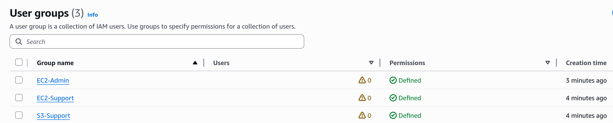
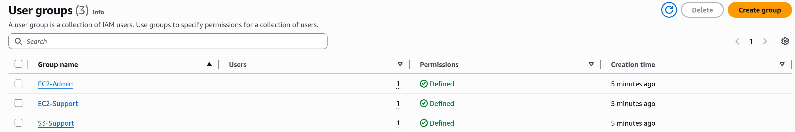
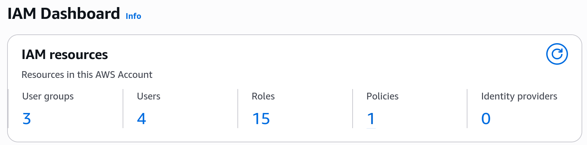
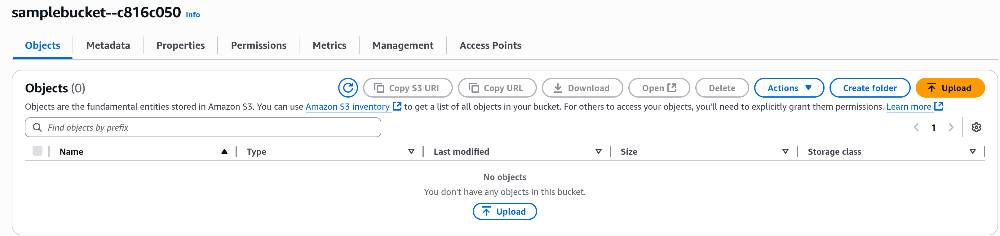
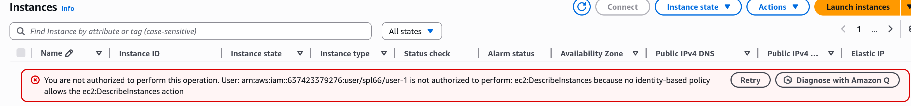
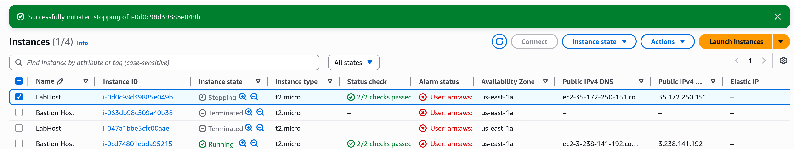

# Important Steps
- Before adding users to groups:

- AFter adding users to groups:

- Dashboard:

- User 1 can see the S3 buckets because it has the permissions:

- User 1 can not see the EC2 instances because it does not have the permissions:

- User 3 is the only one that has start and stop permissions:
