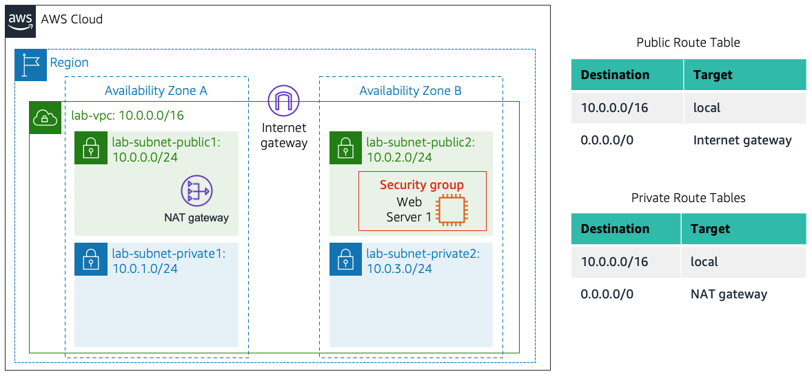
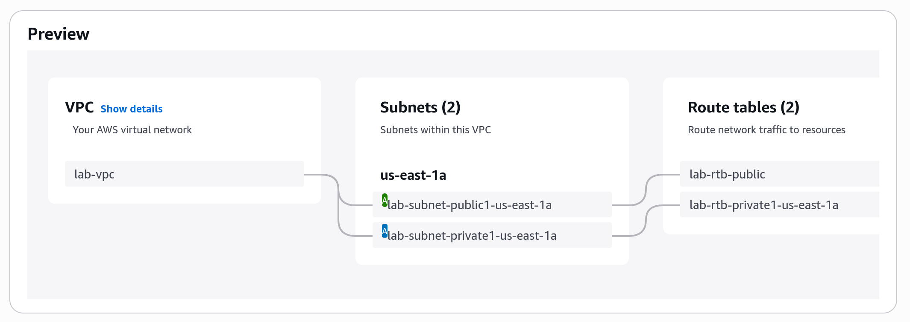
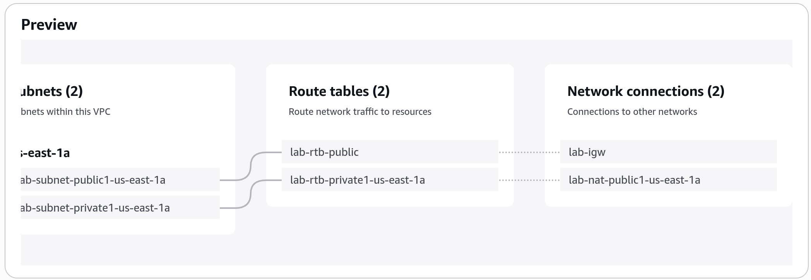
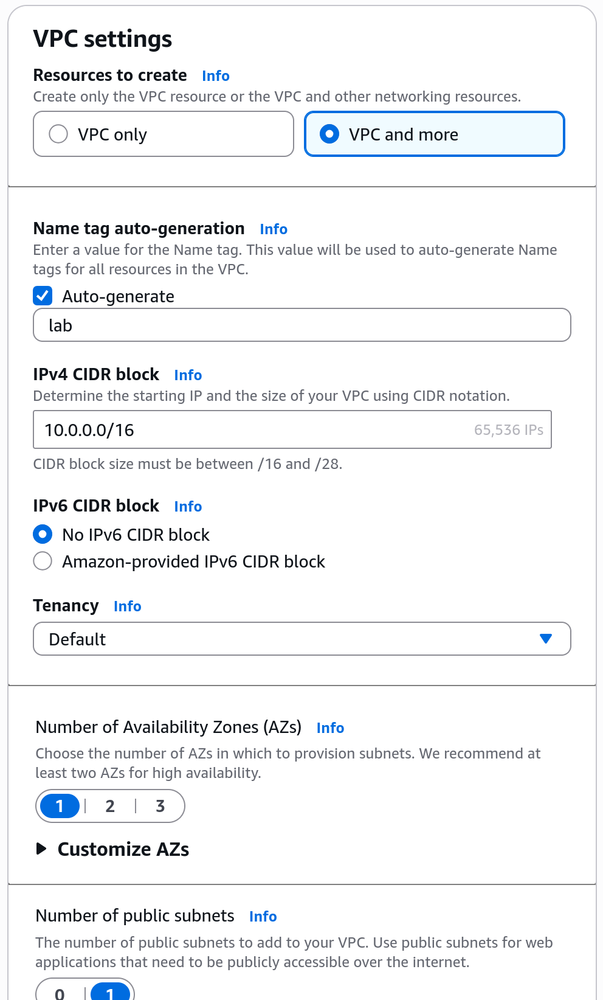
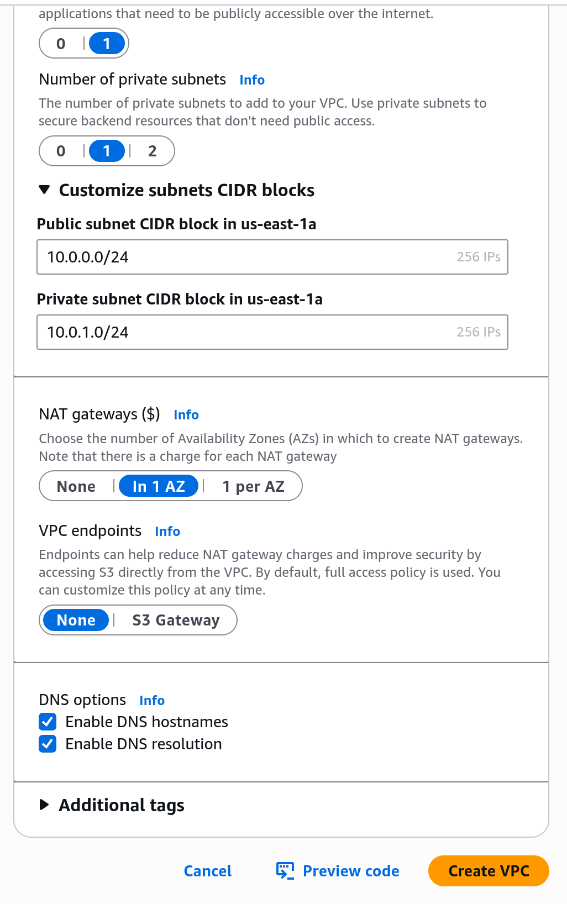
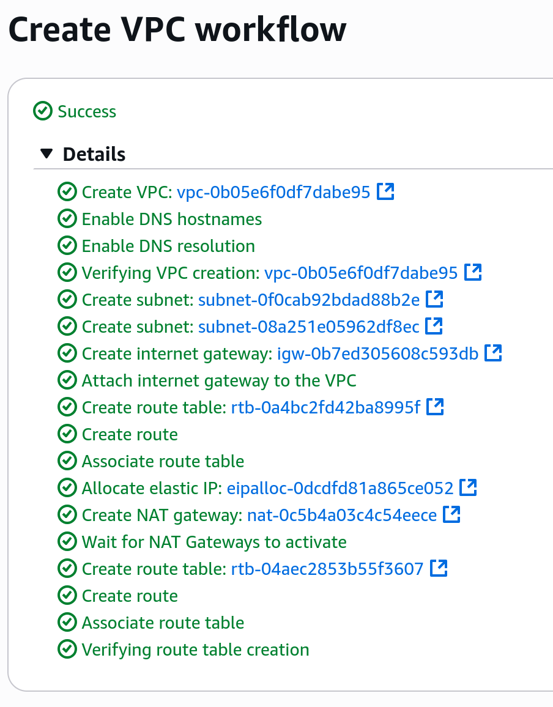
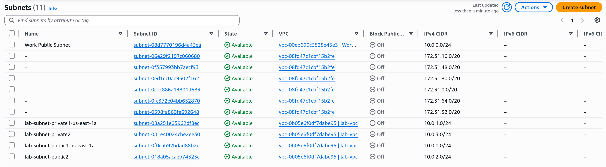
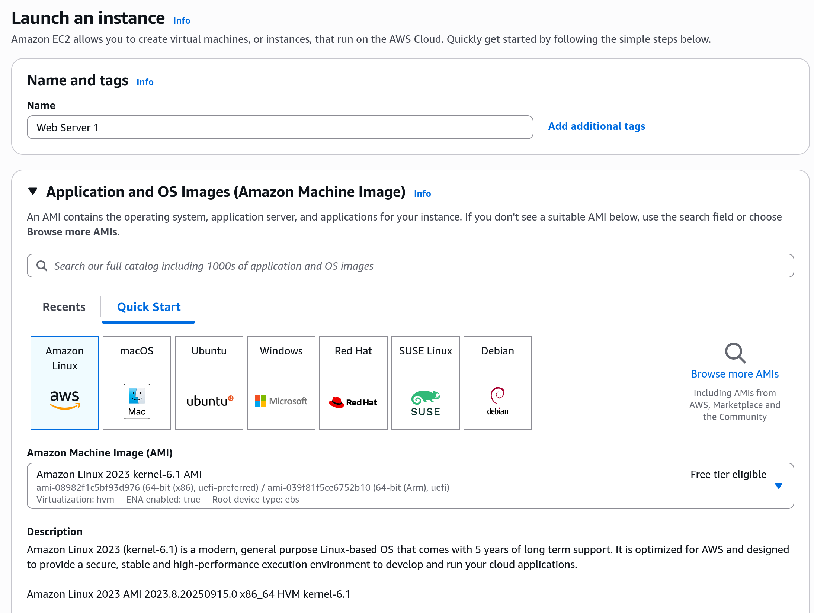
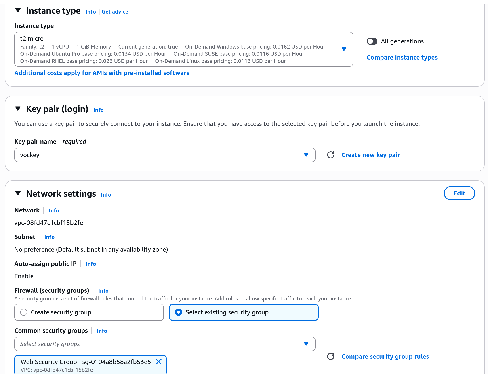

# Important Steps
- You need to be careful when creating them because one mistake can lead to an incorrect instance. In my case I forgot to change it to t2.micro and the default is t3.micro, so the check said I created the instance wrong. I had to redo the step for creating the EC2 instance.

- In this lab we have created this structure:

- When you create a VPC you can create the first public subnet and the first private subnet within an Availability Zone, but if you want to add more subnets you need to add them manually afterwards as explained in the laboratory.

- There are a lot of settings that we have not used or that we used the default, allowing for a better control when you have more expertise.

- Create VPC:

- We then create the additional subnets and we get the following. Note that the only that interest us are the last 4, which are the ones that we created:

- We then associate the subnets so that we know they need to be able to communicate with each other, and to allow private subnets to communicate with the Internet without having direct connection to the Internet Gateway.

- We create a security group because othewise we won't be able to see if the EC2 instance is working.

- We finally create the EC2 instance following the steps we are told:

