# 1. Networking Basics
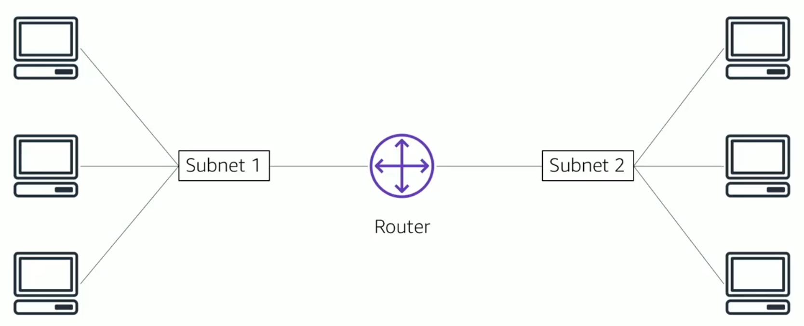

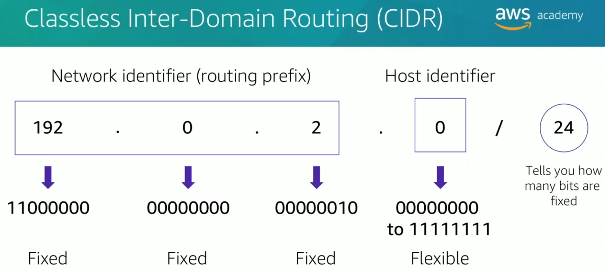

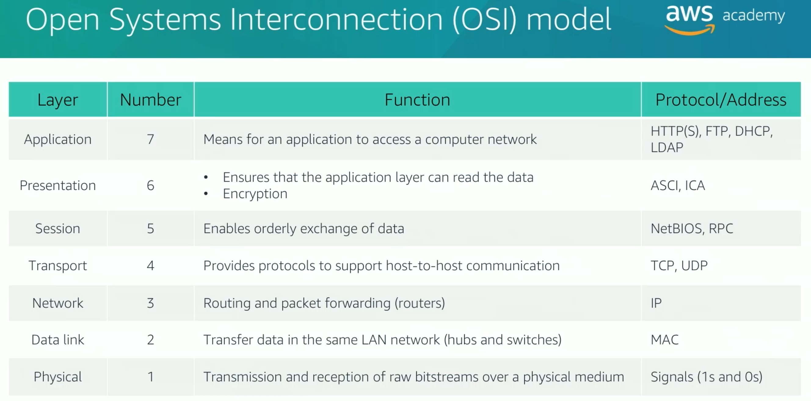

# 2. Amazon Virtual Private Cloud (VPC)
* Enables you to provision a **logically isolated** section of the AWS Cloud where you can launch AWS resources in a virtual network that you define
* Gives you **control over your virtual networking resources**, including:
    * Selection of IP address range
    * Creation of subnets
    * Configuration of route tables and network gateways
* Enables you to **customize the network configuration** for your VPC
* Enables you to use **multiple layers of security**

<table>
    <thead>
      <tr>
        <th>Feature</th>
        <th>VPC (Virtual Private Cloud)</th>
        <th>Subnet</th>
      </tr>
    </thead>
    <tbody>
      <tr>
        <td><strong>Isolation</strong></td>
        <td>A <strong>logically isolated</strong> network dedicated to your AWS account.</td>
        <td>A range of IP addresses <em>within</em> a VPC.</td>
      </tr>
      <tr>
        <td><strong>Scope</strong></td>
        <td>Belongs to a single <strong>AWS Region</strong> and can span multiple Availability Zones.</td>
        <td>Belongs to a single <strong>Availability Zone</strong>.</td>
      </tr>
      <tr>
        <td><strong>Accessibility</strong></td>
        <td>Overall network boundary; access is configured at the subnet level.</td>
        <td>Classified as <strong>public</strong> (direct internet access) or <strong>private</strong> (no direct internet access).</td>
      </tr>
    </tbody>
</table>

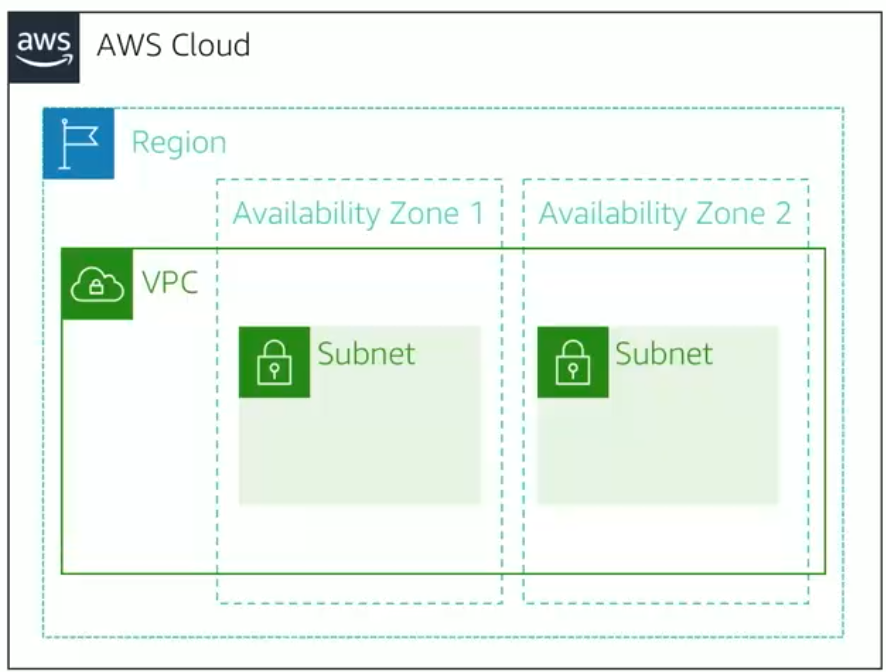

* **Permanent CIDR Block**: A VPC's primary IPv4 CIDR block **cannot be changed** after creation.
* **Size Restrictions**: The IPv4 block size must be between **`/16`** (largest) and **`/28`** (smallest).
* **Non-Overlapping Subnets**: Subnet CIDR blocks within a VPC **cannot overlap**.
* **IPv6 Support**: IPv6 is also supported and has different size limits.

<table>
  <thead>
    <tr>
      <th>Feature</th>
      <th>Public IPv4 Address</th>
      <th>Elastic IP Address (ENI)</th>
    </tr>
  </thead>
  <tbody>
    <tr>
      <td><strong>Assignment</strong></td>
      <td>Auto-assigned at launch</td>
      <td>Manually allocated to your account</td>
    </tr>
    <tr>
      <td><strong>Persistence</strong></td>
      <td><strong>Dynamic</strong>: Lost on instance stop/start</td>
      <td><strong>Static</strong>: Persists until you release it</td>
    </tr>
    <tr>
      <td><strong>Association</strong></td>
      <td>Cannot be remapped</td>
      <td>Can be <strong>remapped</strong> to other resources</td>
    </tr>
    <tr>
      <td><strong>Cost</strong></td>
      <td>Free when instance is running</td>
      <td>Free when instance is running; <strong>incurs charges</strong> when idle</td>
    </tr>
  </tbody>
</table>

<table>
  <thead>
    <tr>
      <th>Feature</th>
      <th>Default Network Interface</th>
      <th>Secondary Network Interface</th>
    </tr>
  </thead>
  <tbody>
    <tr>
      <td><strong>Mobility</strong></td>
      <td>Tied to the instance. Cannot be detached.</td>
      <td>Portable. Can be attached and detached.</td>
    </tr>
    <tr>
      <td><strong>Lifecycle</strong></td>
      <td>Deleted with the instance.</td>
      <td>Persists after instance is deleted.</td>
    </tr>
    <tr>
      <td><strong>Attributes</strong></td>
      <td>Has one primary private IP.</td>
      <td>
        <ul>
          <li>Attributes follow when moved.</li>
          <li>Can have multiple IPs.</li>
        </ul>
      </td>
    </tr>
  </tbody>
</table>

# 3. VPC Networking
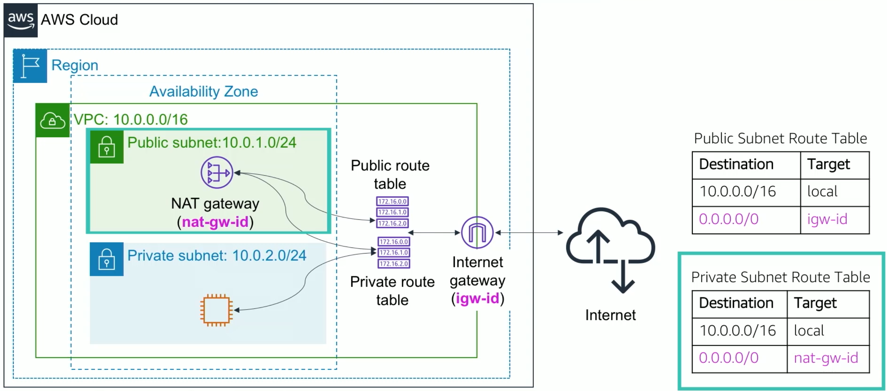

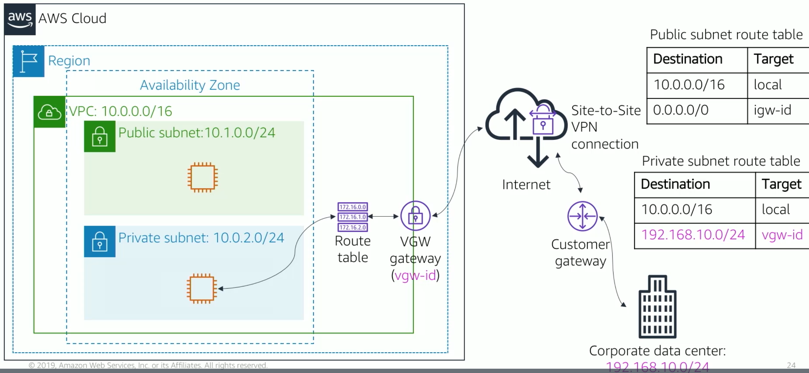

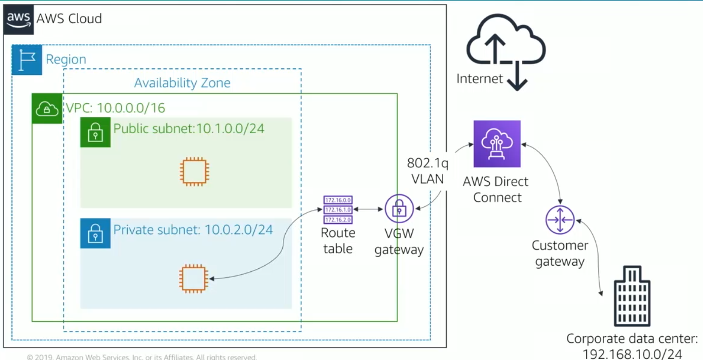

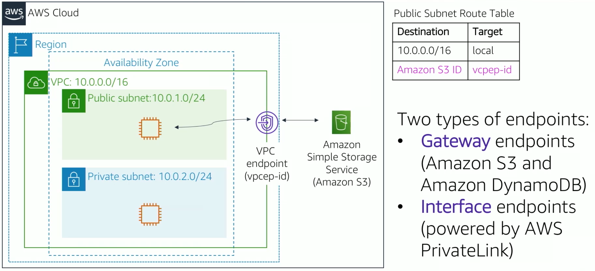

- AWS Transit Gateway allows to connect multiple VPCs without having to connect them using all combinations of P2P.
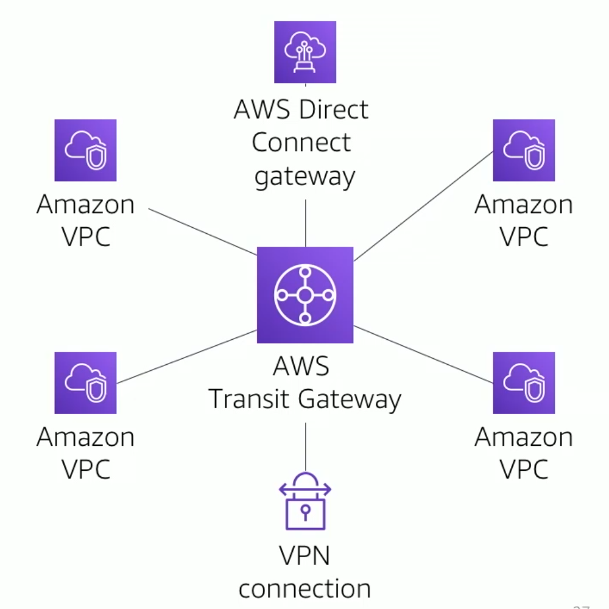

# 4. Security
## 4.1 Security Groups
* Security groups have **rules** to manage instance traffic.
* Default security groups are **sealed shut to inbound traffic**. We need to define rules.
* Security groups are **stateful**. The outbound traffic is always allowed.

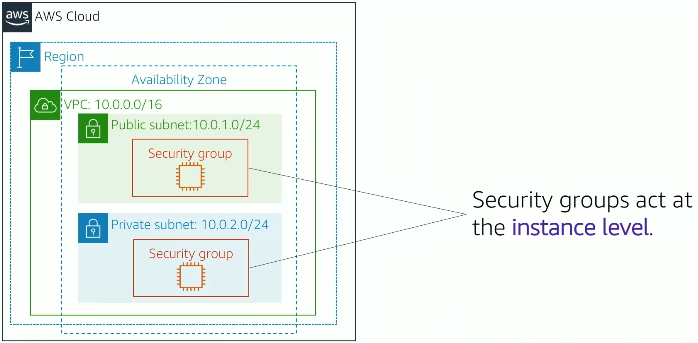

## 4.2 Networking Access Control Lists (ACLs)
* A network ACL has **separate inbound and outbound rules**, and each rule can either **allow or deny traffic**.
* Default network ACLs **allow** all inbound and outbound IPv4 traffic.
* Network ACLs are **stateless**.

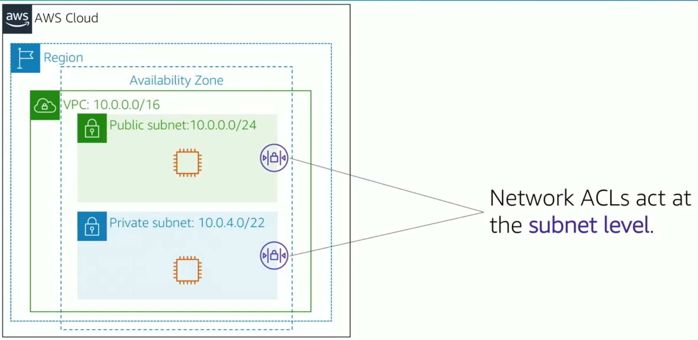
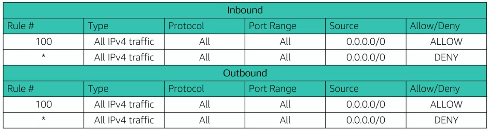

## 4.3 Comparison
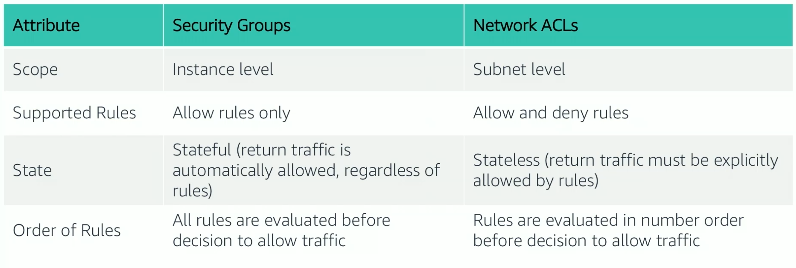

# 5. Amazon Route 53
## 5.1 Definition
* Is a highly available and scalable Domain Name System (DNS) web service
* Is used to route end users to internet applications by translating names (like [www.example.com](http://www.example.com)) into numeric IP addresses (like 192.0.2.1) that computers use to connect to each other
* Is fully compliant with IPv4 and IPv6
* Connects user requests to infrastructure running in AWS and also outside of AWS
* Is used to check the health of your resources
* Features traffic flow
* Enables you to register domain names

## 5.2 Supported Routing
<table>
  <thead>
    <tr>
      <th>Routing Type</th>
      <th>Explanation</th>
    </tr>
  </thead>
  <tbody>
    <tr>
      <td class="top-align"><strong>Simple routing</strong></td>
      <td>Use in single-server environments.</td>
    </tr>
    <tr>
      <td class="top-align"><strong>Weighted routing</strong></td>
      <td>Assign weights to resource record sets to specify the frequency.</td>
    </tr>
    <tr>
      <td class="top-align"><strong>Latency routing</strong></td>
      <td>Help improve your global applications.</td>
    </tr>
    <tr>
      <td class="top-align"><strong>Geolocation routing</strong></td>
      <td>Route traffic based on location of your users.</td>
    </tr>
    <tr>
      <td class="top-align"><strong>Geoproximity routing</strong></td>
      <td>Route traffic based on location of your resources.</td>
    </tr>
    <tr>
      <td class="top-align"><strong>Failover routing</strong></td>
      <td>Fail over to a backup site if your primary site becomes unreachable.</td>
    </tr>
    <tr>
      <td class="top-align"><strong>Multivalue answer routing</strong></td>
      <td>Respond to DNS queries with up to eight healthy records selected at random.</td>
    </tr>
  </tbody>
</table>

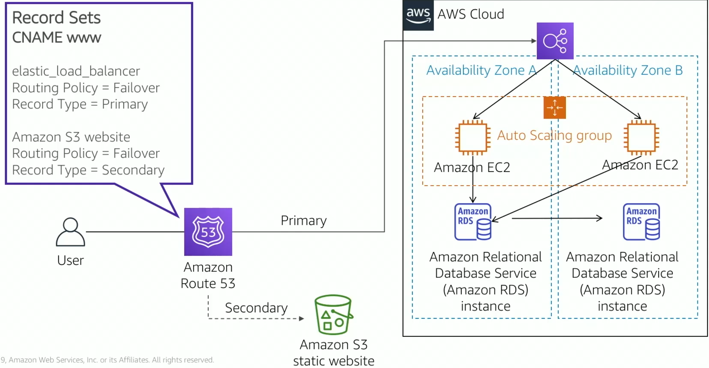

## 5.3 Amazon Cloudfront
* Fast, global, and secure CDN service
* Global network of edge locations and Regional edge caches
* Self-service model
* Pay-as-you-go pricing

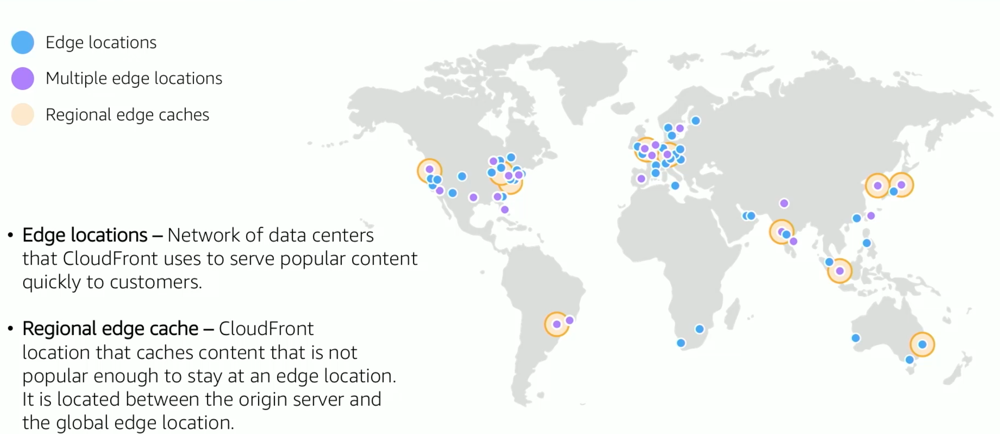

<style>
  .top-align {
    vertical-align: top;
  }