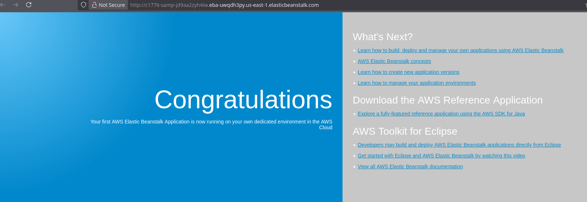

# Important Steps
- At first we can not access the website because there is nothing deployed in the environment:

- After deploying the website we can now see the website is working:

- Now we can see that Beanstalk has created 2 instances for our website:

