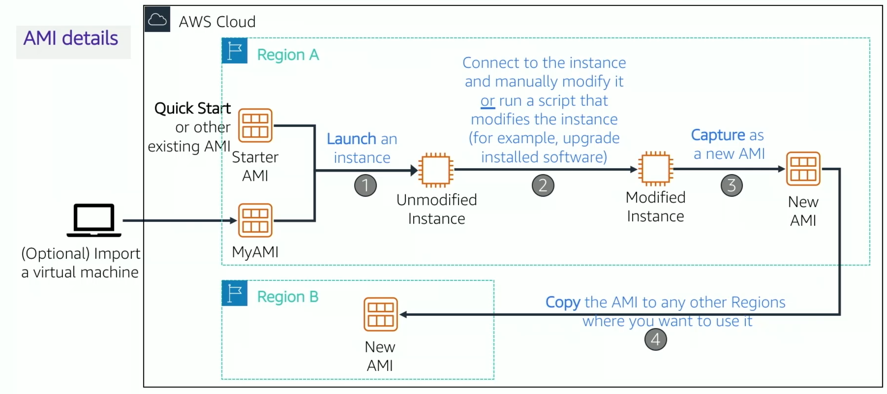
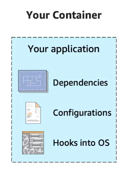
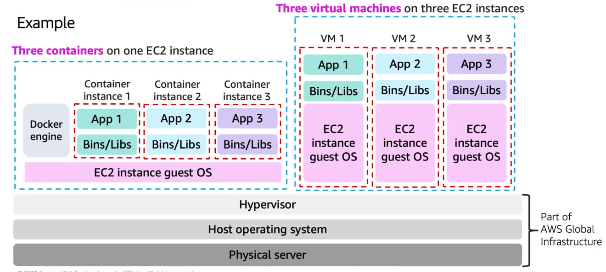
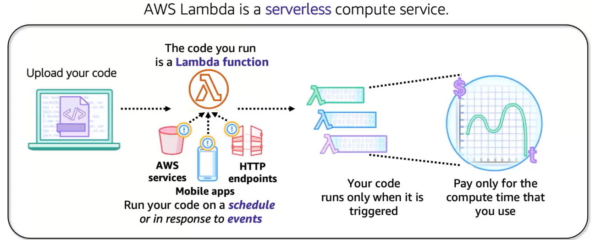
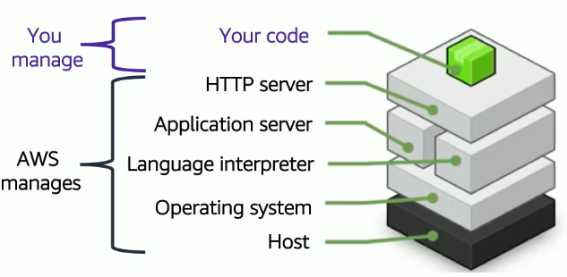

# 1. Categories of compute services

# 2. Amazon EC2
- Service to run your own applications
- You have full control of the host OS
- You can launch instances of any size into any Availability Zone
- There are 9 choices that need to be made

## 2.1 Select Amazon Machine Image (AMI)
- Template used to create an EC2 instance
- Windows or Linux

## 2.2 Instance type
It determines:
- Memory (RAM)
- PRocessing power (CPU)
- Disk space and type (storage)
- Network performance

## 2.3 Network settings
- Network bandwidth depends on instance type
- Enhanced networking types:
    - Elastic Network Adapter (ENA): supports network speeds up to 100 Gbps
    - Intel Virtual Function Interface: supports up to 10 Gbps
- Should a public IP be created?

## 2.4 IAM role
* Will software on the EC2 instance need to interact with other AWS services?
    * If yes, attach an appropriate **IAM Role**.
* An AWS Identity and Access Management (IAM) role that is attached to an EC2 instance is kept in an **instance profile**.
* You are *not* restricted to attaching a role only at instance launch.
    * You can also attach a role to an instance that already exists.

## 2.5 User data
Of course. Here is the text from the image converted into Markdown format.

* Optionally specify a user data script at instance launch
* Use **user data** scripts to customize the runtime environment of your instance
    * *Script executes the first time the instance starts*
* Can be used strategically
    * For example, reduce the number of custom AMIs that you build and maintain

## 2.6 Storage Options
Here's the text from the image in Markdown format:

* Configure the **root volume**
    * Where the guest operating system is installed
* Attach **additional storage volumes** (optional)
    * AMI might already include more than one volume
* For each volume, specify:
    * The **size** of the disk (in GB)
    * The **volume type**
        * Different types of solid state drives (SSDs) and hard disk drives (HDDs) are available
    * If the volume will be deleted when the instance is terminated
    * If **encryption** should be used

| Type | Description |
| :--- | :--- |
| **Amazon Elastic Block Store (Amazon EBS)** | • Durable, block-level storage volumes. • You can stop the instance and start it again, and the data will still be there. |
| **Amazon EC2 Instance Store** | • Storage is provided on disks that are attached to the host computer where the EC2 instance is running. • If the instance stops, data stored here is deleted. |
| **Amazon Elastic File System (EFS)** | |
| **Amazon Simple Storage Service (Amazon S3)** | |

## 2.7 Tags
* A **tag** is a label that you can assign to an AWS resource.
    * Consists of a *key* and an optional *value*.
* Tagging is how you can attach **metadata** to an EC2 instance.
* Potential benefits of tagging—Filtering, automation, cost allocation, and access control.

## 2.8 Security groups
* A **security group** is a set of **firewall rules** that control traffic to the instance.
    * It exists *outside* of the instance's guest OS.
* Create **rules** that specify the **source** and which **ports** that network communications can use.
    * Specify the **port** number and the **protocol**, such as Transmission Control Protocol (TCP), User Datagram Protocol (UDP), or Internet Control Message Protocol (ICMP).
    * Specify the **source** (for example, an IP address or another security group) that is allowed to use the rule.

## 2.9 Key pair
* At instance launch, you specify an existing key pair *or* create a new key pair.
* A **key pair** consists of –
    * A **public key** that AWS stores.
    * A **private key** file that you store.
* It enables secure connections to the instance.
* For **Windows AMIs** –
    * Use the private key to obtain the administrator password that you need to log in to your instance.
* For **Linux AMIs** –
    * Use the private key to use SSH to securely connect to your instance.

# 3. EC2 Cost Optimization
## 3.1 Pricing Models
<table>
    <tr>
        <td class="top-align"><strong>On-Demand Instances</strong></td>
        <td>
            <ul>
                <li>Pay by the hour</li>
                <li>No long-term commitments.</li>
                <li>Eligible for the AWS Free Tier.</li>
            </ul>
        </td>
    </tr>
    <tr>
        <td class="top-align"><strong>Dedicated Hosts</strong></td>
        <td>
            <ul>
                <li>A physical server with EC2 instance capacity fully dedicated to your use.</li>
            </ul>
        </td>
    </tr>
    <tr>
        <td class="top-align"><strong>Dedicated Instances</strong></td>
        <td>
            <ul>
                <li>Instances that run in a VPC on hardware that is dedicated to a single customer.</li>
            </ul>
        </td>
    </tr>
    <tr>
        <td class="top-align"><strong>Reserved Instances</strong></td>
        <td>
            <ul>
                <li>Full, partial, or no upfront payment for instance you reserve.</li>
                <li>Discount on hourly charge for that instance.</li>
                <li>1-year or 3-year term.</li>
            </ul>
        </td>
    </tr>
    <tr>
        <td class="top-align"><strong>Scheduled Reserved Instances</strong></td>
        <td>
            <ul>
                <li>Purchase a capacity reservation that is always available on a recurring schedule you specify.</li>
                <li>1-year term.</li>
            </ul>
        </td>
    </tr>
    <tr>
        <td class="top-align"><strong>Spot Instances</strong></td>
        <td>
            <ul>
                <li>Instances run as long as they are available and your bid is above the Spot Instance price.</li>
                <li>They can be interrupted by AWS with a 2-minute notification.</li>
                <li>Interruption options include terminated, stopped or hibernated.</li>
                <li>Prices can be significantly less expensive compared to On-Demand Instances.</li>
                <li>Good choice when you have flexibility in when your applications can run.</li>
            </ul>
        </td>
    </tr>
</table>

## 3.2 Use Cases

## 3.3 How to reduce costs
<table>
    <tr>
        <td class="top-align"><strong>1. Right size</strong></td>
        <td>
            <ul>
                <li>Provision instances to match the need
                    <ul>
                        <li>CPU, memory, storage, and network throughput</li>
                        <li>Select appropriate instance types for your use</li>
                    </ul>
                </li>
                <li>Use <strong>Amazon CloudWatch</strong> metrics
                    <ul>
                        <li>How idle are instances? When?</li>
                        <li>Downsize instances</li>
                    </ul>
                </li>
                <li><strong>Best practice</strong>: Right size, then reserve</li>
            </ul>
        </td>
    </tr>
    <tr>
        <td class="top-align"><strong>2. Increase elasticity</strong></td>
        <td><ul>
        <li><strong>Stop or hibernate</strong> Amazon EBS-backed instances that are not actively in use
            <ul>
                <li>Example: non-production development or test instances</li>
            </ul>
        </li>
        <li>Use <strong>automatic scaling</strong> to match needs based on usage
            <ul>
                <li>Automated and time-based elasticity</li>
            </ul>
        </li>
    </ul></td>
    </tr>
    <tr>
        <td class="top-align"><strong>3. Optimal pricing model</strong></td>
        <td><ul>
        <li>Leverage the right pricing model for your use case
            <ul>
                <li>Consider your usage patterns</li>
            </ul>
        </li>
        <li>Optimize and <em>combine</em> purchase types</li>
        <li>Examples:
            <ul>
                <li>Use <strong>On-Demand Instance</strong> and <strong>Spot Instances</strong> for variable workloads</li>
                <li>Use <strong>Reserved Instances</strong> for predictable workloads</li>
            </ul>
        </li>
        <li>Consider serverless solutions (AWS Lambda)</li>
    </ul></td>
    </tr>
    <tr>
        <td class="top-align"><strong>4. Optimize storage</strong></td>
        <td><ul>
        <li>Reduce costs while maintaining storage performance and availability</li>
        <li>Resize EBS volumes</li>
        <li>Change EBS volume types
            <ul>
                <li>Can you meet performance requirements with less expensive storage?</li>
                <li>Example: <strong>Amazon EBS Throughput Optimized HDD (st1)</strong> storage typically costs half as much as the default <strong>General Purpose SSD (gp2)</strong> storage option.</li>
            </ul>
        </li>
        <li>Delete EBS snapshots that are no longer needed</li>
        <li>Identify the most appropriate destination for specific types of data
            <ul>
                <li>Does the application need the instance to reside on Amazon EBS?</li>
                <li>Amazon S3 storage options with lifecycle policies can reduce costs</li>
            </ul>
        </li>
    </ul></td>
    </tr>
</table>

# 4. Container Services
Containers are a method of operating system virtualization. Example: Docker
Benefits:
* Repeatable.
* Self-contained environments.
* Software runs the same in different environments.
    * Developer's laptop, test, production.
* Faster to launch and stop or terminate than virtual machines

## 4.1 Amazon Elastic Container Service (ECS)
Helps to manage containers. Key question: Do you want to manage the Amazon ECS cluster that runs the containers?

* If **yes**, create an **Amazon ECS cluster backed by Amazon EC2** (provides more granular control over infrastructure)

* If **no**, create an **Amazon ECS cluster backed by AWS Fargate** (easier to maintain, focus on your applications)

## 4.2 Amazon Elastic Kubernetes Service (EKS)
Complements Docker. Manage clusters of Amazon EC2 compute instances:

* Enables you to run Kubernetes on AWS
* Certified Kubernetes conformant (supports easy migration)
* Supports Linux and Windows containers
* Compatible with Kubernetes community tools and supports popular Kubernetes add-ons

Use to:
* Manage clusters of Amazon EC2 compute instances
* Run containers that are orchestrated by Kubernetes on those instances

## 4.3 Amazon Elastic Container Registry (ECR)
Fully managed Docker **container registry** that makes it easy for developers to store, manage, and deploy Docker container images.

# 5. AWS Lambda

* It supports multiple programming languages
* Completely automated administration
* Built-in fault tolerance
* It supports the orchestration of multiple functions
* Pay-per-use pricing

**Soft limits** per Region:
* Concurrent executions = 1,000
* Function and layer storage = 75 GB

**Hard limits** for individual functions:
* Maximum function memory allocation = 10,240 MB
* Function timeout = 15 minutes
* Deployment package size = 250 MB unzipped, including layers
* Container image code package size = 10 GB

# 6. AWS Elastic Beanstalk
* An easy way to get **web applications** up and running

* A **managed service** that automatically handles –
    * Infrastructure provisioning and configuration
    * Deployment
    * Load balancing
    * Automatic scaling
    * Health monitoring
    * Analysis and debugging
    * Logging

* **No additional charge for Elastic Beanstalk**
    * Pay only for the underlying resources that are used

* It supports web applications written for common platforms
    * **Java**, **.NET**, **PHP**, **Node.js**, **Python**, **Ruby**, **Go**, and **Docker**

* You upload your code
    * Elastic Beanstalk automatically handles the deployment
    * Deploys on servers such as **Apache**, **NGINX**, **Passenger**, **Puma**, and **Microsoft Internet Information Services (IIS)**

