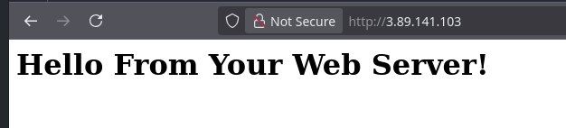
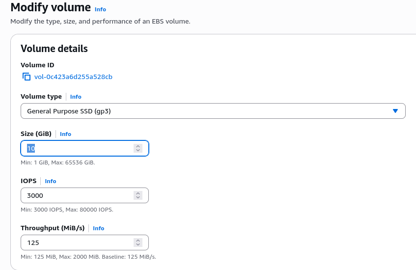
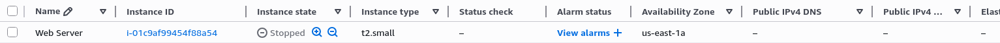
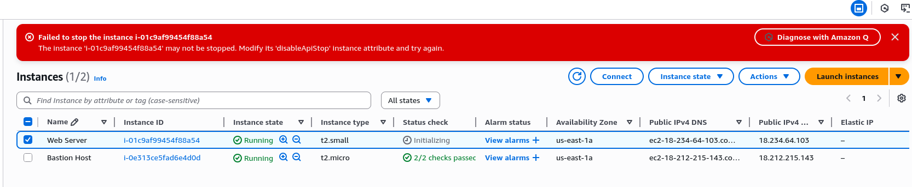

# Important Steps
- After adding the correct security group we can see that the server is now accessible when before it wasn't:

- To modify a volume you first need to stop the instance:

- We can not stop an instance if it has instance stop protection enabled:

