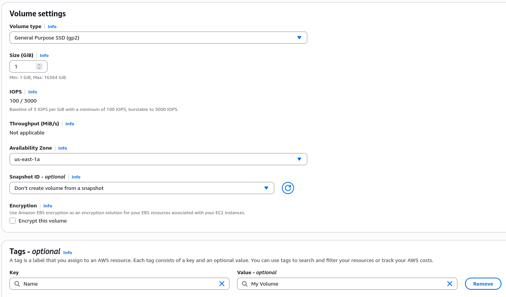
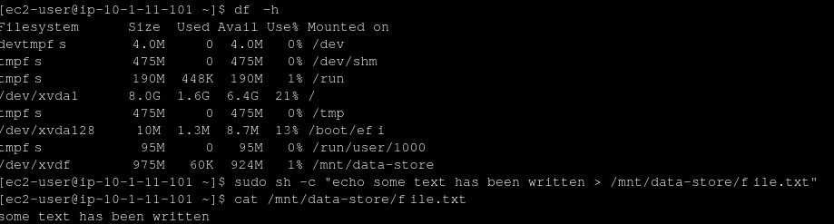
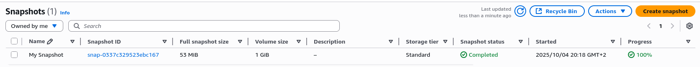
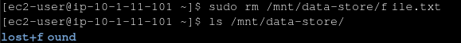
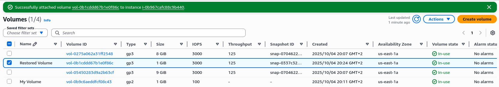
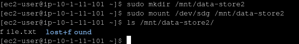

# Important Steps
- Create a volume:

- After attaching the volume to the instance we can connect to the instance. Then we mount this new block and we get the result below:

- After creating a snapshot it appears in the snapshots tab:

- Now we want to test if the snapshot is working. We now delete the file using ``sudo rm /mnt/data-store/file.txt``:

- And then we restore the snapshot we made previously to get back the deleted file. After connecting to the same EC2 instance, we can see that in this new volume we can see the file we deleted earlier:

