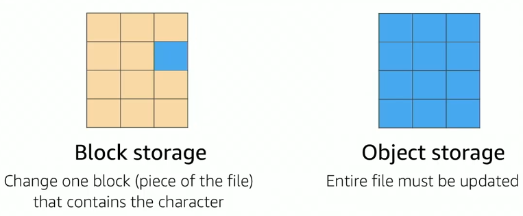
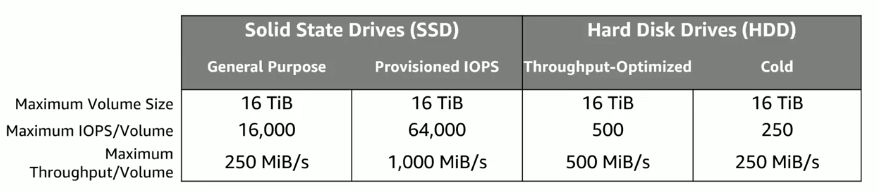
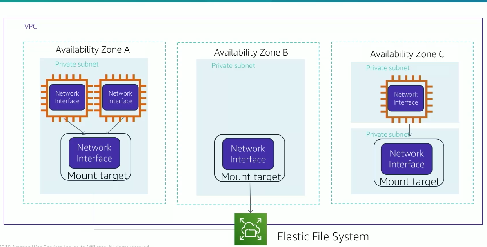
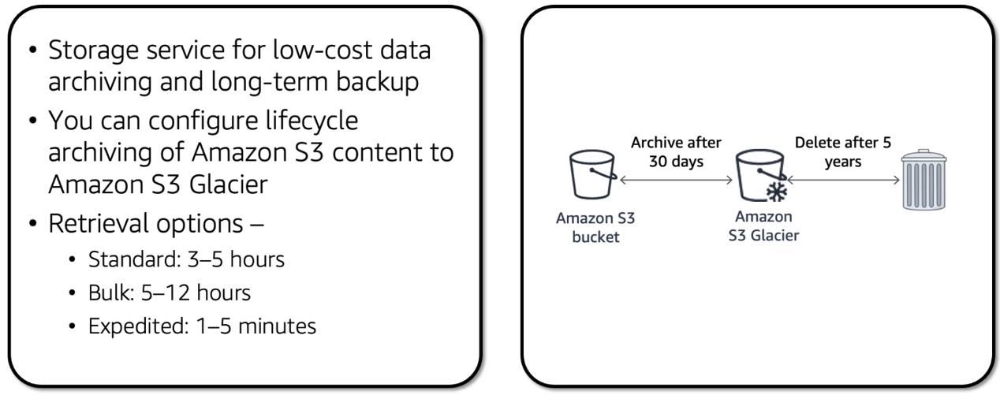
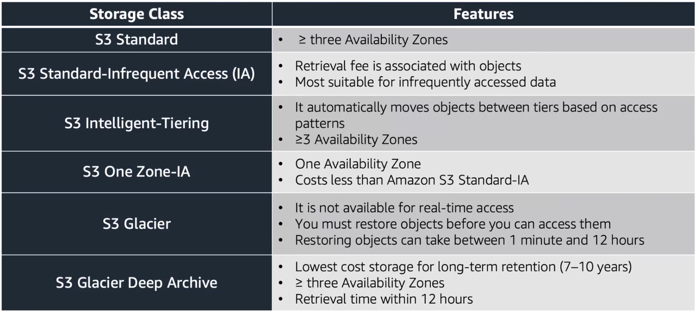

# 1. Amazon Elastic Block Store (EBS)
Also known as non-volatile storage. They use less bandwidth than object storage but they might cost more.

Amazon EBS enables you to **create individual storage volumes** and **attach them to an Amazon EC2 instance**:

* **Amazon EBS** offers **block-level storage**.
* Volumes are automatically **replicated within its Availability Zone**.
* It can be backed up automatically to **Amazon S3** through snapshots.
* Uses include:
    * Boot volumes and storage for Amazon Elastic Compute Cloud (**Amazon EC2**) instances
    * Data storage with a file system
    * Database hosts
    * Enterprise applications

<table>
    <tr>
      <td><strong>Snapshots</strong></td>
      <td>
        <ul>
          <li>Point-in-time snapshots</li>
          <li>Recreate a new volume at any time</li>
        </ul>
      </td>
    </tr>
    <tr>
      <td><strong>Encryption</strong></td>
      <td>
        <ul>
          <li>Encrypted Amazon EBS volumes</li>
          <li>No additional cost</li>
        </ul>
      </td>
    </tr>
    <tr>
      <td><strong>Elasticity</strong></td>
      <td>
        <ul>
          <li>Increase capacity</li>
          <li>Change to different types</li>
        </ul>
      </td>
    </tr>
</table>

<table>
    <tr>
      <td><strong>1. Volumes</strong></td>
      <td>
        <ul>
          <li>Amazon EBS volumes persist independently from the instance.</li>
          <li>All volume types are charged by the amount that is <strong>provisioned per month</strong>.</li>
        </ul>
      </td>
    </tr>
    <tr>
      <td><strong>2. IOPS</strong></td>
      <td>
        <ul>
          <li><strong>General Purpose SSD:</strong>
            <ul>
              <li>Charged by the amount that you provision in <strong>GB per month</strong> until storage is released.</li>
            </ul>
          </li>
          <li><strong>Magnetic:</strong>
            <ul>
              <li>Charged by the <strong>number of requests</strong> to the volume.</li>
            </ul>
          </li>
          <li><strong>Provisioned IOPS SSD:</strong>
            <ul>
              <li>Charged by the amount that you provision in <strong>IOPS</strong> (multiplied by the percentage of days that you provision for the month).</li>
            </ul>
          </li>
        </ul>
      </td>
    </tr>
    <tr>
      <td><strong>3. Snapshots</strong></td>
      <td>
        <ul>
          <li>Added cost of Amazon EBS snapshots to Amazon S3 is <strong>per GB-month</strong> of data stored.</li>
        </ul>
      </td>
    </tr>
    <tr>
      <td><strong>4. Data transfer</strong></td>
      <td>
        <ul>
          <li><strong>Inbound</strong> data transfer is <strong>free</strong>.</li>
          <li><strong>Outbound</strong> data transfer across Regions <strong>incurs charges</strong>.</li>
        </ul>
      </td>
    </tr>
</table>

# 2. AWS Simple Storage Service (S3)
Object level storage: if you want to change a part of a file you need to make the change and then reupload the whole object.
- Data is stored in resources called **buckets**
- Single object limtied to 5TB
- Granular access to bucket and objects

<table>
    <tr>
      <td><strong>Amazon S3 Standard</strong></td>
      <td>
        <ul>
          <li>High availability, durability and performance.</li>
          <li>Frequently accessed data.</li>
          <li>Low latency and high throughput.</li>
          <li>Content distribution and big data analytics.</li>
        </ul>
      </td>
    </tr>
    <tr>
      <td><strong>Amazon S3 Intelligent-Tiering</strong></td>
      <td>
        <ul>
            <li>Optimize costs by automatically moving data to the most cost-effective access tier.</li>
            <li>Small monthly fee per object.</li>
            <li>Long-lived data with access patterns that are unknown or unpredictable.</li>
        </ul>
      </td>
    </tr>
    <tr>
      <td><strong>Amazon S3 Standard-Infrequent Access (Amazon S3 Standard-IA)</strong></td>
      <td>
        <ul>
            <li>Data accessed less frequently but requires rapid access when needed.</li>
          <li>High durability.</li>
          <li>High throughput and low latency.
          </li>
          <li>Low per gigabyte storage price and per gigabyte retrieval fee.</li>
          <li>Long-term storage and backups, datastore for disaster recovery files.</li>
        </ul>
      </td>
    </tr>
    <tr>
      <td><strong>Amazon S3 One Zone-Infrequent Access (Amazon S3 One Zone-IA)</strong></td>
      <td>
        <ul>
            <li>Data accessed less frequently but requires rapid access when needed.</li>
            <li>Unlike others that store data in a minimum of 3 availability zones, this one only stores data in 1.</li>
            <li>Costs less than standard and standard infrquent.</li>
            <li>Lower cost option for infrequently accessed data but do not require the availability and resilience of standard.</li>
            <li>Secondary backups or easy-to-recreate data.</li>
        </ul>
      </td>
    </tr>
    <tr>
      <td><strong>Amazon S3 Glacier</strong></td>
      <td>
        <ul>
          <li>Secure, durable and low-cost storage class for data archiving.</li>
          <li>3 retrieval options that range from minutes to hours.</li>
          <li>Lowest cost storage class.</li>
          <li>Long-term retention and digital presevation (1-2 per year).</li>
          <li>Financial services, healthcare and public sectors.</li>
        </ul>
      </td>
    </tr>
    <tr>
      <td><strong>Amazon S3 Glacier Deep Archive</strong></td>
      <td>
        <ul>
          <li>Can also be used for backups and datastore for disaster recovery files.</li>
          <li>Cost-effective and easy-to-manage alternative to magnetic tape systems.</li>
          <li>Complements the previous storage type.</li>
          <li>Objects can be restored within 12 hours.</li>
        </ul>
      </td>
    </tr>
</table>

Pay only for what you use, including:
* GBs per month
* Transfer OUT to other Regions
* PUT, COPY, POST, LIST, and GET requests

You do not pay for:
* Transfers IN to Amazon S3
* Transfers OUT from Amazon S3 to Amazon CloudFront or Amazon EC2 in the same Region

<table>
    <tr>
      <td><strong>1. Storage Classes</strong></td>
      <td>
        <ul>
          <li><strong>Standard storage</strong> is designed for:
            <ul>
              <li><strong>11 9s of durability</strong></li>
              <li><strong>Four 9s of availability</strong></li>
            </ul>
          </li>
          <li><strong>S3 Standard-Infrequent Access (S-IA)</strong> is designed for:
            <ul>
              <li><strong>11 9s of durability</strong></li>
              <li><strong>Three 9s of availability</strong></li>
            </ul>
          </li>
        </ul>
      </td>
    </tr>
    <tr>
      <td><strong>2. Amount of storage</strong></td>
      <td>
        <ul>
          <li>Pricing is based on the number and size of <strong>objects</strong>.</li>
        </ul>
      </td>
    </tr>
    <tr>
      <td><strong>3. Requests</strong></td>
      <td>
        <ul>
          <li>Pricing is based on the number of requests (GET, PUT, COPY).</li>
          <li>There are <strong>different rates for GET requests</strong> than other requests.</li>
        </ul>
      </td>
    </tr>
    <tr>
      <td><strong>4. Data transfer</strong></td>
      <td>
        <ul>
          <li>Pricing is based on the amount of data that is <strong>transferred out</strong> of the Amazon S3 Region.</li>
          <li>Data transfer **in is free**, but you incur charges for data that is transferred out.</li>
        </ul>
      </td>
    </tr>
</table>

# 3. AWS Elastic File System (EFS)
* Enables you to run Kubernetes on AWS
* Certified Kubernetes conformant (supports easy migration)
* Supports Linux and Windows containers
* Compatible with Kubernetes community tools and supports popular Kubernetes add-ons
* Use Amazon EKS to:
    * Manage clusters of Amazon EC2 compute instances
    * Run containers that are orchestrated by Kubernetes on those instances

# 4. AWS S3 Glacier
*Data archiving service* that is designed for security, durability, and an extremely low cost.

* Amazon S3 Glacier is designed to provide **11 9s of durability** for objects.
* It supports the **encryption of data in transit and at rest** through Secure Sockets Layer (**SSL**) or Transport Layer Security (**TLS**).
* The **Vault Lock** feature enforces compliance through a policy.
* **Extremely low-cost** design works well for long-term archiving.
    * Provides three options for access to archives—**expedited**, **standard**, and **bulk**—retrieval times range from a few minutes to several hours.

