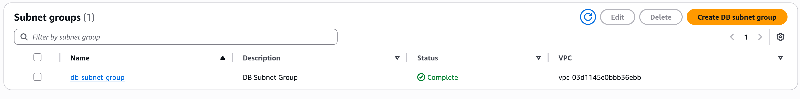
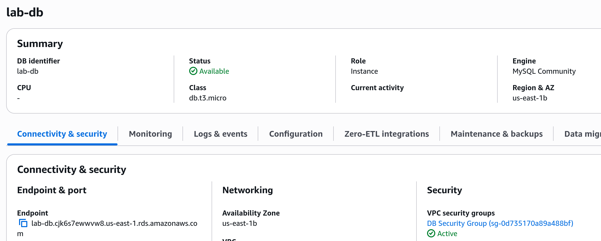
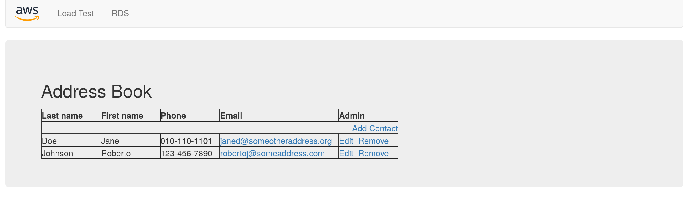

# Important Steps
- The subnet is correctly created and connected to the database:

- We get the endpoint from the details page so that we can connect to the webpage accessed by the lab session:

- We get the phone book contacts by connecting to the database and we can edit and remove them using the correct buttons:

